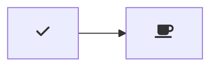
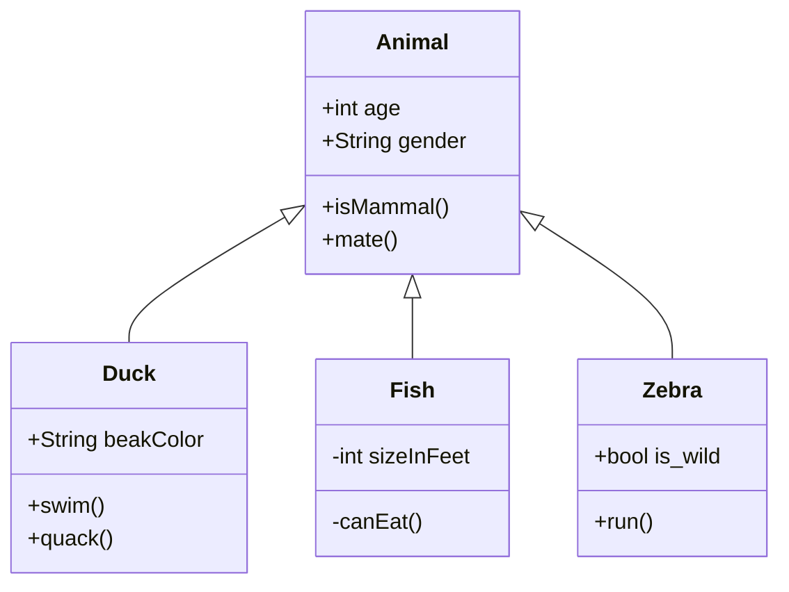
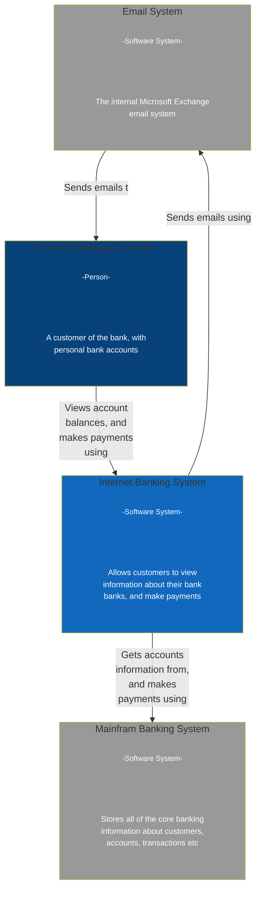

# Documento de arquitectura del componente ACME Store

## Introducción

<figure>

```mermaid
graph TD;
    A-->B;
    A-->C;
    B-->D;
    C-->D;
```

<figcaption>Hola mundo</figcaption>
</fugure>

## Diagrama 2

Hola mundo

```mermaid
graph LR
    fa:fa-check-->fa:fa-coffee
```

```mermaid
classDiagram
    Animal <|-- Duck
    Animal <|-- Fish
    Animal <|-- Zebra
    Animal : +int age
    Animal : +String gender
    Animal : +isMammal()
    Animal : +mate()
    class Duck {
      +String beakColor
      +swim()
      +quack()
    }
    class Fish {
      -int sizeInFeet
      -canEat()
    }
    class Zebra {
      +bool is_wild
      +run()
    }
```

```mermaid
flowchart TB

subgraph personalBankingCustomer[Personal Banking Customer]
    h1[-Person-]:::type
    d1[A customer of the bank, with \n personal bank accounts]:::description
end
personalBankingCustomer:::person

subgraph internetBankingSystem[Internet Banking System]
    h2[-Software System-]:::type
    d2[Allows customers to view \n information about their bank \n banks, and make payments]:::description
end
internetBankingSystem:::internalSystem

subgraph mainframeBankingSystem[Mainfram Banking System]
    h3[-Software System-]:::type
    d3[Stores all of the core banking \n information about customers, \n accounts, transactions etc]:::description
end
mainframeBankingSystem:::externalSystem

subgraph emailSystem[Email System]
    h4[-Software System-]:::type
    d4[The internal Microsoft Exchange \n email system]:::description
end
emailSystem:::externalSystem

personalBankingCustomer--Views account \n balances, and \n makes payments \n using-->internetBankingSystem
internetBankingSystem--Gets accounts \n information from, \n and makes \n payments using-->mainframeBankingSystem
internetBankingSystem--Sends emails using--> emailSystem
emailSystem--Sends emails to-->personalBankingCustomer

%% Element type definitions

classDef person fill:#08427b
classDef internalSystem fill:#1168bd
classDef externalSystem fill:#999999

classDef type stroke-width:0px, color:#fff, fill:transparent, font-size:12px
classDef description stroke-width:0px, color:#fff, fill:transparent, font-size:13px
```

## Hola mundo 