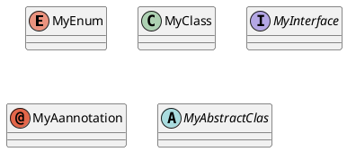
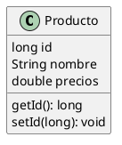
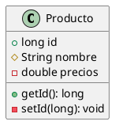
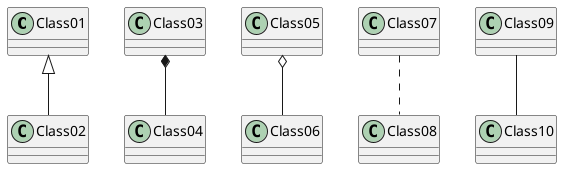
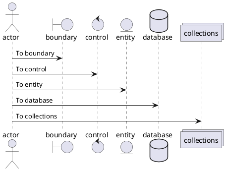
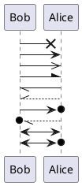
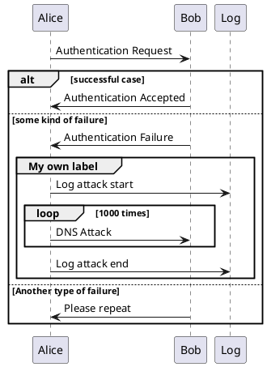

<br><br><br><br>




<br><br><br><br><br>




<br><br><br>



<br><br><br><br>



<br><br><br>



<br><br><br>




<br><br><br><br>


```plantuml
@startuml
!include https://raw.githubusercontent.com/plantuml-stdlib/C4-PlantUML/master/C4_Context.puml

title ACME Store

Person(customer, "Customer", "Cliente del ecommerce")

Enterprise_Boundary(b1, "ACME Store") { 
    System(ACMEStoreSys, "ACME Store", "Aplicación web de ventas de productos online")
    System_Ext(erpSys, "ERP", "ERP desde el cúal se gestiona el <br>catálogo de productos e inventarios")
    System_Ext(paymentServiceSys, "PaymentService", "Service de procesamiento de pagos")
    System_Ext(KeycloakSys, "Keycloak", "Servicio de autenticación y autorización")
}

Rel(customer, ACMEStoreSys, "Cliente del ecommerce")
Rel(ACMEStoreSys, erpSys, "Administración de productos e inventarios")
Rel(ACMEStoreSys, paymentServiceSys, "Procesamiento de pagos")
Rel(ACMEStoreSys, KeycloakSys, "Autenticación y autorización")
@enduml
```
