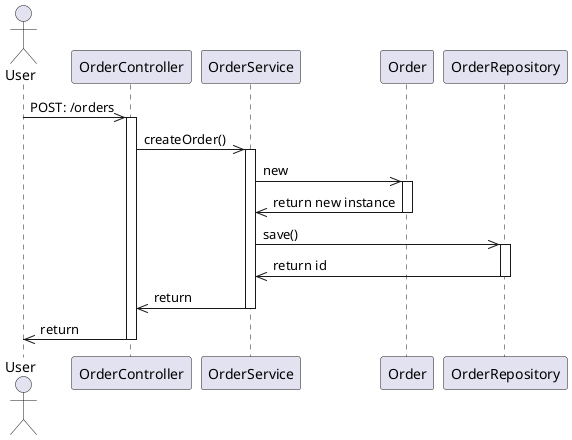

```plantuml
@startuml
actor User
User ->> OrderController: POST: /orders
activate OrderController
OrderController ->> OrderService: createOrder()
activate OrderService
OrderService ->> Order: new
activate Order
Order ->> OrderService: return new instance
deactivate Order
OrderService ->> OrderRepository: save()
activate OrderRepository
OrderRepository ->> OrderService: return id
deactivate OrderRepository
OrderService ->> OrderController: return
deactivate OrderService
OrderController ->> User: return
deactivate OrderController
@enduml
```