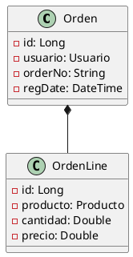

# H1
## H2
### H3
#### H4
##### H5
###### H6


# Párrafos
It is a long established fact that a reader will be distracted by the readable content of a page when looking at its layout. The point of using Lorem Ipsum is that it has a more-or-less normal distribution of letters, as opposed to using 'Content here, content here', making it look like readable English. Many desktop publishing packages and web page editors now use Lorem Ipsum as their default model text, and a search for 'lorem ipsum' will uncover many web sites still in their infancy. Various versions have evolved over the years, sometimes by accident, sometimes on purpose (injected humour and the like).


# Citas

> Camaron que se duerme se lo lleva corriente 


# Viñetas

Esto son viñetas no númericas (funciona con *, +, -)
+ viñeta  
  + viñeta 1.1
+ viñeta 2
+ viñeta 3
+ viñeta 4

Esto son viñetas númericas (funciona con *, +, -)
1) viñeta 1
   1) viñeta 1
2) viñeta 2
3) viñeta 3
4) viñeta 4


# Tablas

Esto es una tabla
| Nombre    | Rol           | Area          |
| --------- | ---------     | ---------     |
| Oscar     | IT Manager    | IT            |


# Fragmentos de código
```javascript
// esto es un fragmento de código de JavaScript
console.log("hola mundo")
```

```java
// esto es un fragmento de código de Java
public class Hello {
    public static void main(String[] args) {
        System.out.println("Hola mundo");
    }
}
```

Esto es un `fragmento de código` en línea


# Links

[Google.com](http://google.com/)

Esto es un link [Google.com](http://google.com/) dentro de un párrafo


# Estilo de texto

Estos es un *fragmento* de texto en itálica

Esto es un **fragmento** de texto en negritas


# Imágenes


# Diagramas 

