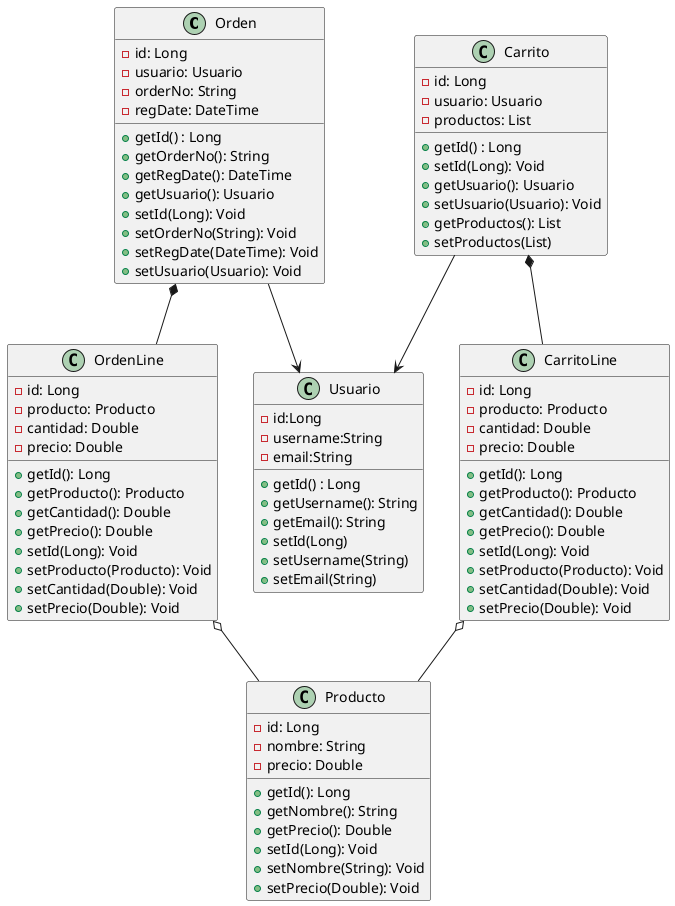
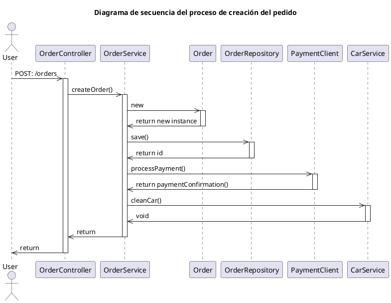
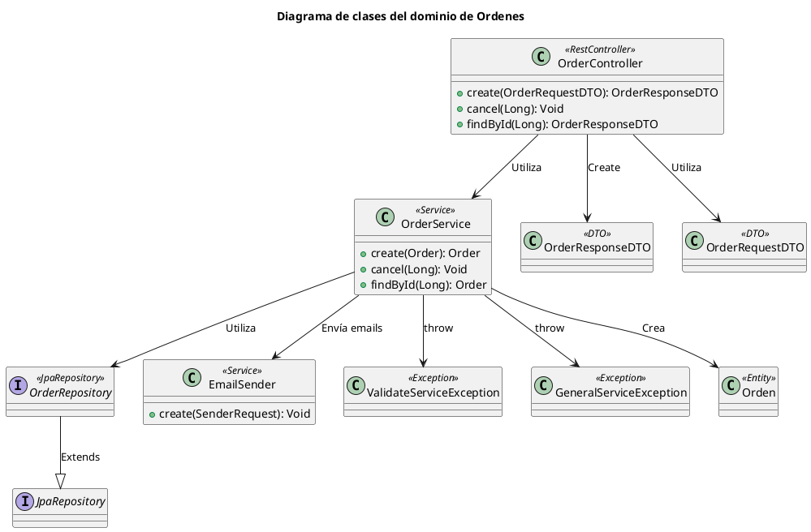

<style type="text/css">
    @import url(../styles/styles.css);
</style>


## APROBADORES DEL DOCUMENTO

| Nombre del aprobador | Rol |
| --------- | --------- |
| Jhon Doe | IT Manager |


## REVISORES DEL DOCUMENTO

| Nombre del aprobador | Rol |
| --------- | --------- |
| Oscar Blancarte | Solution Architect |


## REVISORES DEL DOCUMENTO

| Versión | Fecha | Actualizado por | Descripción |
| --------- | --------- | --------- | --------- |
| 1 | 10/03/2023 | Oscar Blancarte | Solution Architect |


# INTRODUCCIÓN

## Propósito
Este documento tiene como finalidad proveer una visión global y detallada de la arquitectura del sistema, mediante el uso de distintas perspectivas arquitectónicas para representar los diferentes aspectos del mismo. Su propósito es capturar y transmitir las decisiones arquitectónicas más relevantes que se han tomado en relación al sistema.

## Alcance
Este documento intenta explicar la arquitectura del componente ACME Store API, uno de los componentes más importantes del sistema ACME Store. Este documento está acotado a explicar el funcionamiento de este componente y como este se relaciona con los componentes adyacentes. 

## Glosario
| Término | Descripción |
| --------- | --------- |
| REST | Representative State Transfer |
| DAO | Data Access Object |
| DTO | Data Transfer Object |
| Spring Framework | Framework de desarrollo Java de propósito general |
| Spring boot | Framework Java para la creación de microservicios |
| JMS | Java Message Service |
| JWT | JSON Web Token |
| JSON | Javascript Object Notation |


# ARQUITECTURA GENERAL

## Descripción general de la aplicación
ACME Store es una aplicación de comercio electrónico cuyo objetivo principal es procesar pedidos de clientes a través de internet. Aunque pueda parecer una aplicación sencilla, en realidad consta de varios componentes que realizan diversas tareas, desde la capa de presentación (una versión web y otra móvil) hasta el backend, que incluye un API REST y un proceso de sincronización de pedidos con el ERP. Este documento explica la arquitectura del sistema ACME Store, incluyendo los aspectos más relevantes de la arquitectura de software.

## Objetivos generales y restricciones de la arquitectura
Los siguientes requerimientos no funcionales fueron identificados y tomados en cuenta para diseñar la arquitectura del sistema

| Requisitos no funcionales | Descripción |
| --------- | --------- |
| Seguridad | Dado que el sistema procesa pagos en línea, es necesario contar con mecanismos que ayuden a procesar de forma segura los cargos y evitar que los datos bancarios sean mal utilizados, almacenados o explotados por personas no autorizadas. |
| Escalabilidad | Dada las ambiciones de la compañía, se espera que ACME Store pueda funcionar en varios países sin verse afectada por el tráfico que este tenga. De la misma forma, es necesario tomar en cuenta los picos de demanda como las fechas festivas para no detener su operación |
| Usabilidad | Dado que el sistema será utilizado por público en general, tiene que ser diseñado para ser fácilmente utilizable por cualquier persona. |


## Arquitectura de contexto del sistema

```plantuml
@startuml
!include https://raw.githubusercontent.com/plantuml-stdlib/C4-PlantUML/master/C4_Context.puml

title ACME Store

Person(customer, "Customer", "Cliente del ecommerce")
System_Ext(fedexSys, "Software System", "Proveedor de paquetería")

Enterprise_Boundary(b1, "ACME Store") { 
    System(ACMEStoreSys, "ACME Store", "Aplicación web de ventas de productos online")
    System_Ext(erpSys, "ERP", "ERP desde el cúal se gestiona el <br>catálogo de productos e inventarios")
    System_Ext(paymentServiceSys, "PaymentService", "Service de procesamiento de pagos")
    System_Ext(emailSenderSys, "EmailSender", "Servicio de envío de emails")
    System_Ext(KeycloakSys, "Keycloak", "Servicio de autenticación y autorización")
}

Rel(customer, ACMEStoreSys, "Cliente del ecommerce")
Rel(ACMEStoreSys, erpSys, "Administración de productos e inventarios")
Rel(ACMEStoreSys, paymentServiceSys, "Procesamiento de pagos")
Rel(ACMEStoreSys, KeycloakSys, "Autenticación y autorización")
Rel(ACMEStoreSys, emailSenderSys, "Envío de emails y listas de correo")
Rel(ACMEStoreSys, fedexSys, "Cotizar, programar<br>y consultar status de envios")
@enduml
```


ACME Store es la aplicación web de comercio electrónico de ACME Corp, la cual puedes visitar en acmestore.com, o descargando la aplicación desde la App Store. 
ACME Store puede parecer una simple aplicación, sin embargo, es en realidad una serie de componentes que le dan vida al sistema, que van desde la aplicación web, la app para móviles, el API REST de backend y procesos de sincronización de productos y existencias. Además de estos, se hacen uso de otros sistemas, tanto externos como internos, los cuales son:

*	**ERP**: Sistema desde el cual se lleva a cabo el seguimiento de los pedidos, productos e inventarios.
*	**PaymentService**: Es un servicio para procesar pagos, el cual simplifica la integración con los diferentes proveedores de pago.
*	**Keycloak**: Sistema para gestionar la autenticación y la autorización utilizando los estándares de OAuth y OpenID Connect.
*	**EmailSender**: Servicio de infraestructura para enviar correos electrónicos, simplificando la comunicación con los proveedores de Email Marketing, como es el caso de MailChimp.
*	**Fedex**: Representa el API de Fedex para cotizar los envíos.

Más adelante en este mismo documento vamos a profundizar en los componentes que conforman el sistema ACME Store así como el componente central de este documento que es ACME Store API. 


# ARQUITECTURA LÓGICA

## Arquitectura de contenedores
ACME Store es una aplicación de comercio electrónico, compuesto por diferentes componentes que juegan un papel importante dentro de la arquitectura.  Si bien ACME Store tiene la parte visible para el usuario que es la versión web y móvil de la aplicación, existen otros componentes de backend que tiene una importante relevancia para poder procesar los pedidos, realizar los pagos, envío de email, sincronización de productos e inventarios, etc. En este sentido ACME Store API es el componente de backend que expone los servicios y la lógica de negocio que le da vida a la aplicación y en el que nos centraremos en este documento.

```plantuml
@startuml
!include https://raw.githubusercontent.com/plantuml-stdlib/C4-PlantUML/master/C4_Container.puml
  title Diagrama de contenedores del sistema ACME Store
  Person(customer, "Customer", "Cliente del ecommerce")
  System_Ext(paymentServiceSys, "PaymentService", "Servicio para el procesamiento de pagos")
  System_Ext(erpSys, "ERP", "Gestión de productos e inventarios")
   System_Ext(emailServiceSys, "EmailService", "Servicio de envío de emails<br>y listas de correo")

  Container_Boundary(cb1, "ACME Store") {
    Container(acmeStoreWebsiteContainer, "ACME Store Website", "Aplicación web para la venta en línea")
    Container(acmeStoreAppContainer, "ACME Store App", "Aplicación nativa de iOS para la venta en línea")
    Container(acmeStoreAPIContainer, "ACME Store API", "API REST para la consulta y creación de pedidos")
    ContainerQueue(emailQueue, "Email Queue", "Bus de mensajes en Kafka")
    Container(acmeStoreETLContainer, "ETL", "Proceso de extracción de productos e inventarios")
    ContainerDb(acmeStoreDB, "ACME Store database", "DB donde se guarda todos los pedidos")
    ContainerDb(etlTempDatabase, "ETL Temp database", "Almacenamiento temporal para el proceso del ETL")    
  }

  Rel(customer, acmeStoreWebsiteContainer, "Crea y consulta pedidos", "JSON/HTTP")
  Rel(customer, acmeStoreAppContainer, "Crea y consulta pedidos", "JSON/HTTP")

  Rel(acmeStoreWebsiteContainer, acmeStoreAPIContainer, "Delega la creación del pedido", "JSON/HTTP")
  Rel(acmeStoreAppContainer, acmeStoreAPIContainer, "Delega la creación del pedido", "JSON/HTTP")

  Rel(emailServiceSys, emailQueue, "Consumo de mensajes", "AMQP")

  Rel(acmeStoreAPIContainer, acmeStoreDB, "Guarda/Consulta pedidos", "TCP/IP")
  Rel(acmeStoreAPIContainer, emailQueue, "Almacena mensajes para enviar emails", "AMQP")
  Rel(acmeStoreAPIContainer, paymentServiceSys, "Programa la entrega de pedidos", "JSON/HTTP")
  Rel(acmeStoreAPIContainer, erpSys, "Sincroniza los pedidos", "JSON/HTTP")

  Rel(acmeStoreETLContainer, etlTempDatabase, "Envía datos de productos e inventarios", "TCP/IP")
  Rel(acmeStoreETLContainer, acmeStoreDB, "Almancenamiento temporal de procesamiento", "TCP/IP")
@enduml
```

En esta vista de la arquitectura podemos apreciar los siguientes sistemas:

*	**ACME Store Website**: Aplicación web (React) que se renderiza desde el navegador y que es la que los usuarios utilizan para consultar el catálogo de productos y realizar sus pedidos.
*	**ACME Store App**: Aplicación nativa para iOS (Swift) que los usuarios pueden descargar desde la App Store para consultar el catálogo de productos y realizar pedidos.
*	**ACME Store API**: Corresponde al componente de Backend (Spring Boot) que da soporte tanto a la versión web como mobile mediante la exposición de servicios REST.
*	**ACME Store database**: Base de datos (MongoDB) de ACME Store API donde se almacena la información de usuarios, pedidos, productos e inventarios, etc.
*	**ETL**: Proceso (Airflow) de extracción que sincroniza el catálogo de productos e inventarios desde el ERP, hasta la base de datos de ACME Store API. Este proceso se ejecuta todas las noches.
*	**ETL Temp database**: Base de dato (MySQL) utilizada por el proceso ETL para procesar temporalmente el catálogo de productos e inventarios.
*	**Email Queue**: Es la cola (queue en Kafka) que se utiliza para almacenar los mensajes de envío de correo electrónicos, con la finalidad de perder los mensajes y tener bajo acoplamiento con el componente de EmailService.
*	**EmilService**: Es el servicio de infraestructura (reutilizable) utilizado para el envío de correos electrónicos, de tal forma que oculta al proveedor real de email marketing para hacer más simple y estándar el envío de email en toda la compañía.
*	**PaymentService**: Servicio de infraestructura utilizado para el procesamiento de pagos.

ACME Store API es un API REST desarrollado en Spring Boot bajo la arquitectura de microservicios, lo que implica que cuenta con su propio runtime basado en Apache Tomcat y puede ejecutarse por sí mismo sin necesidad de un servidor de aplicaciones. Además, se ejecuta dentro de un contenedor en Kubernetes.


### Proceso de extracción ETL

El proceso de extracción ETL no es parte del contenedor ACME Store API, pero es sumamente relevante para su correcto funcionamiento, ya que los productos y los inventarios son administrados y actualizados desde el ERP. Por tal motivo, el API requiere de un proceso que sincronice los datos todos los días. El proceso ETL es un desarrollo construido exclusivamente con esta finalidad y se trata de un desarrollo en Airflow que extrae los datos de los productos y los inventarios, los almacena temporalmente en su propia base de datos llamada ETL Temp Database para finalmente convertir la información en el formato esperado por la base de datos del API.
Dado que es un proceso tardado por la gran cantidad de productos, se ha tomado la decisión de que se ejecute una sola vez a medianoche. Este proceso está automatizado, sin embargo, si se requiere, puede ser forzado para correr en cualquier hora del día. La importancia de este componente es tal que, si no funcionara correctamente, no se verían reflejados los cambios en los productos y sus inventarios, por lo que es de suma importancia para el correcto funcionamiento de ACME Store API y de la tienda en general.


## Arquitectura de componentes
ACME Store API es construido en capas, donde cada una de ellas cubre una responsabilidad del sistema, estas capas sirven para organizar mejor el proyecto y estandarizar la forma en que estos trabajan. Las capas definidas en el servicio son:

*	**Controllers**: representa la capa de servicios y en esta se definen todos los métodos que serán expuestos como servicio REST. Esta capa se encarga de recibir las peticiones y delegarlas a la capa de servicios. Esta capa no procesa nada de lógica de negocios, solo se limita al procesamiento de las solicitudes y las transformaciones para las respuestas en formato JSON. 
*	**Services**: capa transaccional de la arquitectura, en este se lleva a cabo toda la lógica de negocio y el procesamiento de peticiones al API. Esta capa no se preocupa por el acceso a datos o los formatos de entrada/salida esperados por el API.
*	**Repository**: capa de acceso a datos, ha esta capa se le delega la responsabilidad de consultas, guardado, actualizaciones y borrado a la base de datos. Esta capa no se preocupa por lógica de negocio, solo la comunicación con la base de datos. 


```plantuml
@startuml
!include https://raw.githubusercontent.com/plantuml-stdlib/C4-PlantUML/master/C4_Component.puml

title Diagrama de componentes del contenedor ACME Store API
Container(website, "ACEM Store Website", "Versión web del ecommerce", "React")
  Container(app, "ACEM Store App", "Versión nativa iOS", "Swift")
  System_Ext(keycloak, "Keycloak", "Control de acceso")
  System_Ext(paymentService, "PaymentService", "Servicio para el procesamiento de pagos")
  
  Container_Boundary(apiBundle, "ACME STore API") {
    Component(userController, "UserController", "Provee los servicios REST de usuarios")
    Component(productController, "ProductController", "Provee los servicios REST de productos")
    Component(carController, "CarController", "Provee los servicios REST del carrito de compras")
    Component(orderController, "OrderController", "Provee los servicios REST de ordenes")

    Component(userService, "UserService", "Provee la lógica de negocio de usuarios")
    Component(productService, "ProductService", "Provee la lógica de negocio productos")
    Component(carService, "CarService", "Provee la lógica de negocio del carrito de compras")
    Component(orderService, "OrderService", "Provee la lógica de negocio de ordenes")

    Component(userRepository, "UserRepository", "Lógica de acceso a datos")
    Component(productRepository, "ProductRepository", "Lógica de acceso a datos")
    Component(carRepository, "CarRepository", "Lógica de acceso a datos")
    Component(orderRepository, "OrderRepository", "Lógica de acceso a datos")

    Rel(userController, userService, "Delega la ejecución")
    Rel(productController, productService, "Delega la ejecución")
    Rel(carController, carService, "Delega la ejecución")
    Rel(orderController, orderService, "Delega la ejecución")

    Rel(userService, userRepository, "Acceso a datos")
    Rel(productService, productRepository, "Acceso a datos")
    Rel(carService, carRepository, "Acceso a datos")
    Rel(orderService, orderRepository, "Acceso a datos")
  }

  ContainerDb_Ext(storeDb, "ECME Store Database", "Base de datos del API del ecommerce", "MySQL")

  Rel(website, userController, "")
  Rel(website, productController, "")
  Rel(website, carController, "")
  Rel(website, orderController, "")

  Rel(app, userController, "")
  Rel(app, productController, "")
  Rel(app, carController, "")
  Rel(app, orderController, "")

    
  Rel(userRepository, storeDb, "")
  Rel(productRepository, storeDb, "")
  Rel(carRepository, storeDb, "")
  Rel(orderRepository, storeDb, "")
@enduml
```

Para comprender mejor el funcionamiento de la aplicación, hemos dividido el contenedor en “dominios”, donde cada domino agrupa una serie de clases relacionadas entre sí y que responde en función de una entidad. 


### Dominio de usuarios 
El dominio de usuarios esta encabezado por la entidad User, clase que se omite en el diagrama de componentes para simplificarlo. El dominio de usuarios está conformado por las clases UsuarioController, UserService, UserRepository y la entidad User. Este dominio se centra en la creación de servicios relacionados con los usuarios, como la creación de nuevas cuentas, actualizaciones de perfiles, etc.
En este dominio pueden entrar en juego otras Entidades secundarias y relacionadas como el usuario, como puede ser las Direcciones (Address), métodos de pago (PaymentMethod) y la entidad del perfil del usuario (UserProfile) 

### Dominio de Productos
Este dominio esta encabezado por la entidad Producto, clase que se omite del diagrama de componentes para simplificarlo. El dominio de productos está conformado por las clases ProductController, ProductService, ProductRepository y la entidad Producto. Este dominio se centra en los servicios para la consulta del catálogo de productos y los inventarios.

### Dominio de Carrito de compras
Este dominio está encabezado por la entidad Car, clase que se omite del diagrama de componentes para simplificarlo. El dominio de carrito de compras está conformado por las clases CarController, CarService, CarRepository y la entidad Car. Este dominio se centra en los servicios relacionados con el carrito de compra, como limpiar el carrito, agregar/eliminar productos al carrito, etc.
En este domino interactúa entidades secundarias como la CarItem, que representa un producto dentro del carrito. 

### Dominio de Ordenes
Este dominio esta encabezado por la entidad Orden, clase que se omite del diagrama de componentes para simplificarlo. El dominio de carrito de compras está conformado por las clases OrderController, OrderService, OrderRepository y la entidad Order. Este dominio se centra en las ordenes y los servicios relacionados con esta, como es la creación de pedidos, pago de ordenes, actualizaciones de inventario, cancelación de pedidos, etc. 


## Arquitectura de bajo nivel
En esta sección describiremos aquellos procesos que, por su complejidad o criticidad, son candidatos a diagramar con un detalle más fino.

### Dominio de la aplicación
El siguiente diagrama muestra las Entidades administradas por este componente, las cuales tiene una relación directa con la base de datos.




## Proceso de autenticación
El proceso de autenticación puede resultar complejo en primera instancia, sobre todo si se desconocen los estándares de OAuth y OpenID Connect, por lo que el siguiente diagrama intenta dar una idea más clara del proceso por medio del cuál se lleva a acabo la autenticación de los usuarios.

```plantuml
@startuml
!include https://raw.githubusercontent.com/plantuml-stdlib/C4-PlantUML/master/C4_Dynamic.puml

Person(usuario, "Usuario", "Usuario del ecommerce")

Container_Boundary(acmeStore, "ACME Store") {
  System_Ext(keycloak, "Keycloak", "Proveedor de autenticación")
  Container(website, "ACME Store Website", "Aplicación web", "React") 
}

Container_Boundary(apiBoundary, "ACME Store API") {
  Component(securityContext, "SecurirtyContext", "Spring Security")
  Component(userController, "UserController", "SpringBoot Controller")

  Rel(securityContext, userController, "8. Consulta datos de la cuenta", "JSON/HTTP")
}

Rel(usuario, website, "1. Accede a la página", "HTTP/HTML")
Rel(website, keycloak, "2. Redirecciona al usuario<br>para autenticarlo", "HTTP/HTML")
Rel(usuario, keycloak, "3. Se firma con<br>usuario y password", "HTTP/HTML")
Rel(keycloak, usuario, "4. Autnetica, envía token<br>redirecciona al ecommerce", "HTTP/HTML")
Rel(usuario, website, "5. Accede a la página de inicio", "HTTP/HTML")
Rel(website, securityContext, "6. Consilta datos de la cuenta", "JSON/HTTP")
Rel(securityContext, keycloak, "7. Valida el token del usuario", "JSON/HTTP/OpenID Connect")
Rel(securityContext, userController, "8. Consulta datos de la cuenta", "JSON/HTTP")
Rel(securityContext, website, "9. Retorna datos de la cuenta", "JSON/HTTP")
@enduml
```


Keycloak es un proyecto de código abierto que implementa la autenticación por medio del estándar de OAuth y OpenID Connect y es la base sobre la que funciona el sistema de autenticación de ACME Store.
Cuando un usuario accede a la página de ACME Store, tendrá la opción de iniciar sesión en la página. En primera instancia, el usuario será redirigido a la página de autenticación alojada en Keycloak, donde tendrá que ingresar su usuario y contraseña. Una vez que introduzca sus credenciales, Keycloak las validará y, de ser correctas, redireccionará al usuario de regreso a la página de ACME Store.
Una vez de regreso en la página de ACME Store, la página intentará autenticar al usuario con el token generado por Keycloak, por lo que enviará ese token de regreso a Keyclok para su validación. Si Keyclok lo validar, entonces la página de ACME Store autentica al usuario y regresa los datos del cliente usuario.
De allí en adelante, cada petición que realice el usuario sobre el sistema, tendrá que incluir el token, y ACME Store API lo tendrá que validar nuevamente a fin de validar que sea autentico y vigente.


### Proceso de creación de pedidos
La generación de pedidos es el proceso más importante de la aplicación, pues de este depende que la tienda tenga ventas y pueda ser rentable, además, es un proceso complejo, ya que interviene varios servicios o sistemas externos para su correcto funcionamiento.

```plantuml
@startuml
!include https://raw.githubusercontent.com/plantuml-stdlib/C4-PlantUML/master/C4_Dynamic.puml

  title Proceso de creación de pedidos
  Person(user, "Usuario", "Usuario del ecommerce")
  Container(website, "ACME Store Website", "Aplicación web de comercio electrónico")
  System_Ext(paymentService, "PaymentService", "Servicio para el procesamiento de pagos")
  System_Ext(erp, "ERP", "Sistema de administración de productos e inventarios")
  System_Ext(emailService, "EmailService", "Servicio para el envío de emails")

  Container_Boundary(api, "ACME Store API") {
    Component(orderController, "OrderController", "Controlador que expone servicios de pedidos", "SpringBoot Controller")
    Component(orderService, "OrderService", "Componente que gestiona la lógica de negocio de pedidos", "SpringBoot Service")
    Component(carService, "CarService", "Componente que gestiona la lógica de negocio del carrito de compras", "SpringBoot Repository")

    Rel(orderController, orderService, "3. Delega creación del pedido")
    Rel(orderService, paymentService, "4. Procesar pago", "JSON/HTTP")
    Rel(orderService, erp, "5. Sincroniza los pedidos", "JSON/HTTP")
    Rel(orderService, carService, "6. Limpiar carrito")
    Rel(orderService, emailService, "7. Se envía email de confirmación de pedido", "JSON/HTTP")
  }
  Rel(user, website, "1.Captura datos del pago<br>finaliza pedido", "HTML/HTTP")
  Rel(website, orderController, "2.Crear pedido", "JSON/HTTP")
@enduml
```


El proceso de creación de ordenes se puede disparar desde diferentes medios, ya que al ser un servicio REST, solo basta que un consumidor ejecute el servicio para que se detone la creación, sin embargo, por el momento, los dos únicos actores conocidos que pueden hacer esto son los contenedores ACME Store App y ACME Store Website.

Dicho lo anterior, el proceso de creación se dispara desde el servicio REST de creación de órdenes que responde en el endpoint/orders sobre el método POST. Este recibe la petición y realiza validaciones simples de formato y delega la creación del pedido al componente OrderService, el cual guarda el pedido en la base de datos por medio de la capa de persistencia, realiza el cargo a la tarjeta del cliente mediante el sistema PaymentService, sincroniza el pedido con el ERP y envía un correo electrónico con la confirmación del pedido.

El orden en que se realizan estos pasos se puede apreciar en el siguiente diagrama de secuencia.





El siguiente diagrama ilustra perfectamente como esta conformado el contenedor ACME Store API respecto al dominio de pedidos:





# ARQUITECTURA FÍSICA
La arquitectura física tiene como objetivo ilustrar cómo los contenedores se desplegarán físicamente dentro de los servidores de nuestra infraestructura o de la nube.

```plantuml
@startuml
!include https://raw.githubusercontent.com/plantuml-stdlib/C4-PlantUML/master/C4_Deployment.puml

title Diagrama de despliegue

Deployment_Node(websiteNode, "ACME Store Website", "Firebase") {
  Container(webapp, "ACME Store Website", "Aplicación web de comercio electrónico")
}

Deployment_Node(appNode, "ACME Store App", "App Store") {
  Container(app, "ACME Store Website", "Aplicación App de comercio electrónico")
}

Deployment_Node(acmeStore, "ACME Store Corp", "Infraestructura OnPremise") {
  Deployment_Node(dbNode, "acmestore-db-01") {
    Deployment_Node(mysqlNode, "MySQL - Master") {
      Container(acmeStoreDb, "ACME Store DB", "Base de datos de ACME Store API")
    }
  }

  Deployment_Node(kubernetesNode, "Kurbenetes") {
    Deployment_Node(podNode, "ACME Store Corp", "Pod") {
      Container(api, "ACME Store API", "API de backend para el ecommerce")
    }
  }
}

Deployment_Node(erpNode, "ERP Cloud", "Cloud del proveedor del ERP") {
  System_Ext(erp, "ERP", "Sistema de gestión de productos<br>inventarios,pedidos")
}

Rel(webapp, api, "Llamadas REST", "JSON/HTTP")
Rel(app, api, "Llamadas REST", "JSON/HTTP")
Rel(api, acmeStoreDb, "Actualiza pedidos", "TCP/IP")
Rel(api, erp, "Llamadas REST", "JSON/HTTP")
@enduml
```


ACME Corp cuenta con una robusta infraestructura on-premise que le permite desplegar sus aplicaciones de forma loca con infraestructura propia. Para esto, ACME Corp cuenta un cluster de Kubernetes para desplegar aplicaciones y también cuenta con la posibilidad de desplegar aplicaciones en maquinas virtuales o físicas. 

Los elementos que aparecen en este diagrama son:


*	**ACME Store Website**: Esta desplegado sobre Firebase, por lo que es una plataforma totalmente administrada por Google y no se requiere acciones para escalar la aplicación.
*	**ACME Store App**: Al ser una aplicación nativa de iOS, la aplicación de sube a la App Store y se ejecuta en el smarthpone de cada cliente.
*	**ACME Store API**: El API REST de la aplicación está desplegado sobre un cluster de Kubernetes alojado en la infraestructura de ACME Corp, por lo que la gestión y el escalamiento de este componente esta a cargo de ACME Corp. Inicialmente la aplicación funciona en 3 instancias de contenedor.
*	**ACME Store Database**: Base de datos MySQL donde se almacena toda la información del API. Esta base de datos se ejecuta desde una máquina virtual llamada “acmestore-db-01”.
*	**ERP**: Al ser un sistema de un tercero, es ejecutado y administrado en su totalidad por el proveedor, por lo que vive en la nube del vendor.

